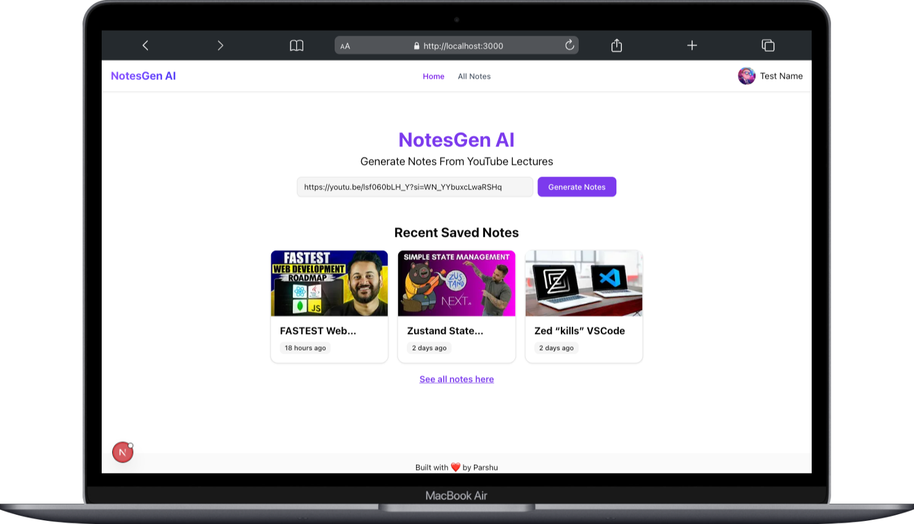

# 📘 NotesGen AI – Smart YouTube Notes Generator

An AI-powered web app that generates structured notes from YouTube videos using Google Generative AI. Built with Next.js 14 App Router, TypeScript, Zustand, Tailwind CSS, and Supabase.

> 🚀 Generate concise notes from educational videos instantly with AI. Perfect for students, creators, and lifelong learners.



---

## ✨ Features

- 🎯 **AI Notes Generation**: Generate smart notes using Google Generative AI.
- 📺 **YouTube Integration**: Extract transcripts and generate context-aware summaries.
- 💾 **Smart Caching**: Caches notes for 24 hours to avoid redundant API calls and reduce cost.
- 🗂️ **Saved Notes Management**: Save, view, and delete notes with a dedicated dashboard.
- 🔐 **Authentication**: Secure login/signup with Supabase Auth.
- ⚙️ **Global State Management**: Used Zustand stores for saved notes, caching, and app state.
- 📱 **Responsive UI**: Mobile and tablet-friendly layout using Tailwind CSS + ShadCN.
- 📊 **Cache Statistics**: Track cache behavior and expiry.

---

## 🛠️ Tech Stack

| Category       | Tech Used                                      |
| -------------- | ---------------------------------------------- |
| Framework      | [Next.js 14 (App Router)](https://nextjs.org/) |
| Language       | TypeScript                                     |
| Styling        | Tailwind CSS, ShadCN UI                        |
| State Mgmt     | Zustand, Context API                           |
| AI Integration | Google Generative AI (via fetch API)           |
| Auth           | Supabase Auth                                  |
| Data Handling  | REST API                                       |
| Hosting        | Vercel                                         |

---

## 📸 Demo

🔗 **Live App:** [notes-gen-ai.vercel.app](https://notes-gen-ai.vercel.app)  
🔗 **Portfolio:** [mrparshu.live](https://mrparshu.live)

---

## 🚀 Getting Started

### 1. Clone the repo

```bash
git clone https://github.com/parshuram-bagade/notes-gen-ai.git

cd notes-gen-ai
```

### 2. Install dependencies

```bash
pnpm install
```

### 3. Set up environment variables

Create a .env.local file:

```text
NEXT_PUBLIC_SUPABASE_URL=
NEXT_PUBLIC_SUPABASE_ANON_KEY=
NEXT_PUBLIC_YOUTUBE_API_KEY=
NEXT_GEMINI_API_KEY=
NEXTAUTH_URL=http://localhost:3000
NEXT_YOUTUBE_TRANSCRIPT_RAPID_API_API_KEY=
NEXT_YOUTUBE_TRANSCRIPT_RAPID_API_HOST=
```

### 4. Run the dev server

```bash
pnpm dev
```

---

## 📂 Folder Structure

```
app/                 → Next.js App Router Pages & Layouts
components/          → Reusable UI Components
hooks/               → Custom React Hooks
lib/                 → Services, utils, and types
store/               → Zustand Global State Stores
public/              → Static files (images, icons, etc.)
```

---

## 🤝 Contributions

Feel free to fork the repo, raise issues, or open PRs.
For major changes, please open an issue first to discuss what you’d like to change.

---

## 📧 Contact

Made with ❤️ by Parshuram Bagade

🔗 Connect on [LinkedIn](https://www.linkedin.com/in/parshuram-bagade/) | ✉️ [parshuram.dev@outlook.com](mailto:parshuram.dev@outlook.com)
